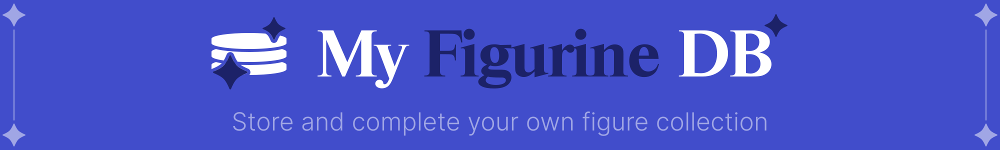

  
  
  
  
  
  
  
  

**MyFiguDB** is a personal **figurine collection manager**.  
It allows users to **search**, **track**, and **organize** their figure collection, monitor **resellers**, and **discover new releases**.

> Built with a **PERN** stack: **PostgreSQL** (via Prisma ORM), **Express**, **React**, **Node.js** (and Nodemon).

---

## About MyFiguDB

- Create your personal figure **collection**
- Build your **wishlist** with upcoming releases
- View figures with **images** and details
- **Search** figures by license, series, or character
- Track **purchase status** and release dates
- Check **prices** and **availability** from **resellers**
- Explore **other users’** collections and wishlists

---

## Database Schema

### Users & Collection
- `user` → [id, name, username, password]
- `figure_user` → [user_id, figure_id, comment, score, is_bought, buy_at]

### Figures & Metadata
- `figure` → [id, name, size, release_date]
- `editor` → [id, name]
- `series` → [id, name]
- `figure_image` → [id, figure_id, size]
- `figure_status` → [id, name]

### Characters & Licenses
- `character` → [id, name, license_id]
- `license` → [id, name]
- `figure_character` → [figure_id, character_id]

### Resellers
- `reseller` → [id, name, url]
- `figure_reseller` → [figure_id, reseller_id, price, ref, url, status]

---

## Tech Stack

| Layer    | Tech                            |
|----------|---------------------------------|
| Frontend | React                           |
| Backend  | Node.js (and Nodemon) + Express |
| Database | PostgreSQL + Prisma (ORM)       |
| Images   | Minio + Ngnix                   |

---

## 📄 API

### Figures
> - GET /api/figures
> - GET /api/figures/:id
> - POST /api/figures
> - PATCH /api/figures/:id
> - DELETE /api/figures/:id

> - GET /api/figures/:id/images
> - POST /api/figures/:id/images

### Series
> - GET /api/series
> - GET /api/series/:id
> - POST /api/series
> - PATCH /api/series/:id
> - DELETE /api/series/:id

> - GET /api/series/:id/figures
> - POST /api/series/:id/figures

### Editors
> - GET /api/editors
> - GET /api/editors/:id
> - POST /api/editors
> - PATCH /api/editors/:id
> - DELETE /api/editors/:id

> - GET /api/editors/:id/figures
> - POST /api/editors/:id/figures

### Users
> - GET /api/users
> - GET /api/users/:id

### Authentication
> - POST /api/auth/login
> - POST /api/auth/register

### Resellers
> - GET /api/resellers
> - GET /api/resellers/:id
> - POST /api/resellers
> - PATCH /api/resellers/:id
> - DELETE /api/resellers/:id

> - GET /api/resellers/:id/figures
> - POST /api/resellers/:id/figures

### Characters
> - GET /api/characters
> - GET /api/characters/:id
> - POST /api/characters
> - PATCH /api/characters/:id
> - DELETE /api/characters/:id

> - GET /api/characters/:id/figures
> - POST /api/characters/:id/figures

### Licenses
> - GET /api/licenses
> - GET /api/licenses/:id
> - POST /api/licenses
> - PATCH /api/licenses/:id
> - DELETE /api/licenses/:id

> - GET /api/licenses/:id/characters
> - POST /api/licenses/:id/characters

---

## 📄 License

Licensed under the MIT License.